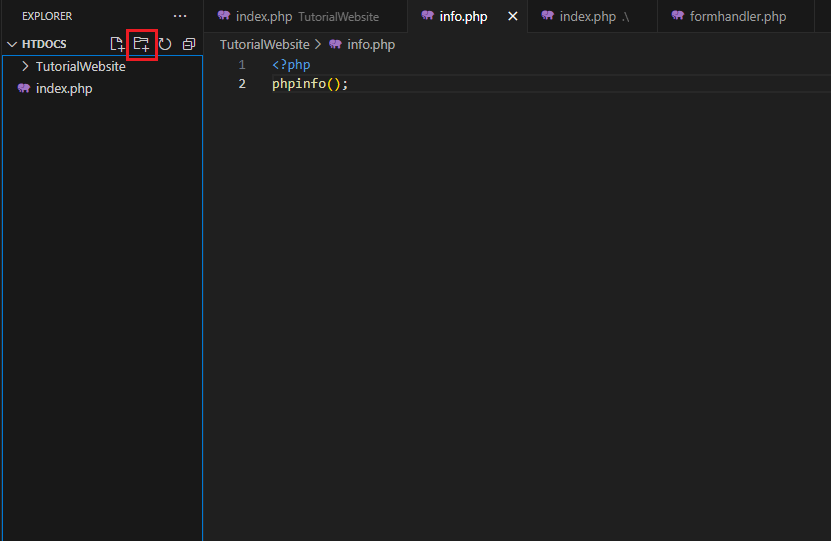
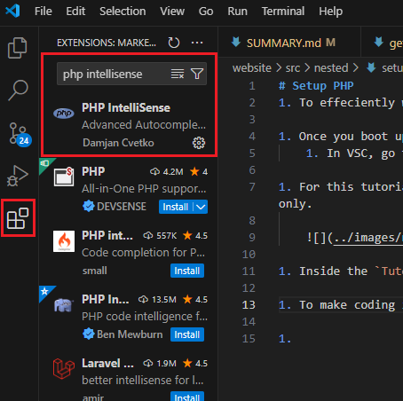

# Setup PHP
1. To effeciently write PHP, you'll need a code editor. I recommend using [Visual Studio Code](https://code.visualstudio.com/).

1. Once you boot up VSC (visual studio code), add the `htdocs` folder in `xampp`:
    1. In VSC, go to `file > open folder`, and search for the `htdocs` folder in `xampp` and click `add folder`.

1. For this tutorial, create a new folder called `TutorialWebsite` in the `htdocs` folder. You can do this in VSC itself using the `new folder` button at the top. Image below for reference only.

    

1. Inside the `TutorialWebsite` folder, create a new file called `index.php` and open it up. 

1. To make coding in PHP easier, you'll have to download the `PHP Intellisense` extension in VSC. Click on the extensions tab in VSC and search `PHP Intellisense` and install it.
    
    

1. Great, you're now ready to code PHP! To learn about PHP, I recommend using [w3schools](https://www.w3schools.com/php/default.asp) and watching [this](https://www.youtube.com/watch?v=m52ljs78S24&list=PL0eyrZgxdwhwwQQZA79OzYwl5ewA7HQih&index=2) youtube tutorial playlist.