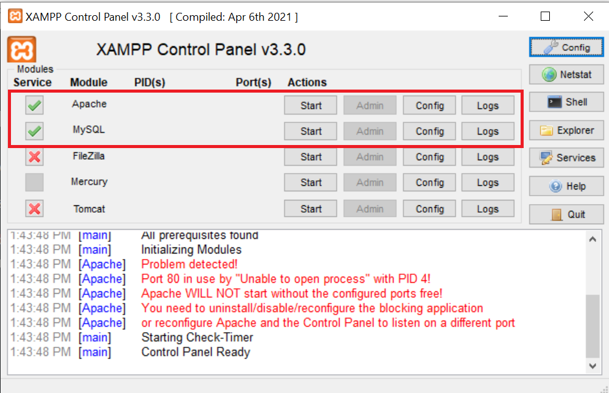
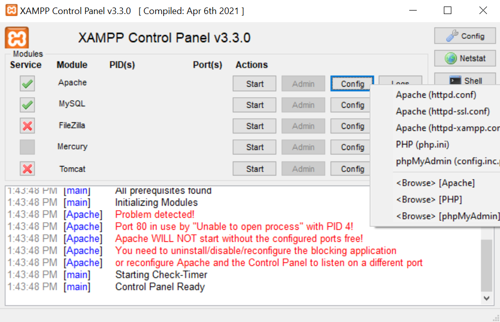

# Setup XAMPP
1. Download XAMPP using [this](https://www.apachefriends.org/download.html) link. Make sure to download `XAMPP for Windows`.

1. Unzip the folder and place it in your `C:/` drive.

1. To boot up XAMPP, run `xampp-control.exe`. Also, for quick access in the future, you can pin it to the task bar. Your XAMPP should look like this:

    

1. Now click `Start` for both `Apache` and `MySQL`.

1. If you notice the error: `Problem Detected! Port 80 in use by ...` when trying to run Apache, this is because something is using `port 80` on the `localhost` currently. To fix this, click on `config` button on the Apache row and select `Apache (httpd.conf)` in notepad.

    

1. What XAMPP does is to default to use `port 80` on the `localhost` as a server. Since it's in use, we can just change the port number to something else. Hit `CTRL + F` to find `80` within the notepad. Replace ALL the `80` in the notepad with a number like `8080`.

1. You'll have to do the same for the `SSL` port. Open up `config>Apache (httd-ssl.conf)` and find `443` within the notepad. Replace ALL the `443`s in the notepad with a number like `4443`.

1. Make sure to save all your changes and restart XAMPP. When you try to run Apache after making the changes, it should work and stay on `[Apache] Status change detected: running` in the consolse

1. Once that is done, you can move onto [setting up PHP](./setup-php.md).