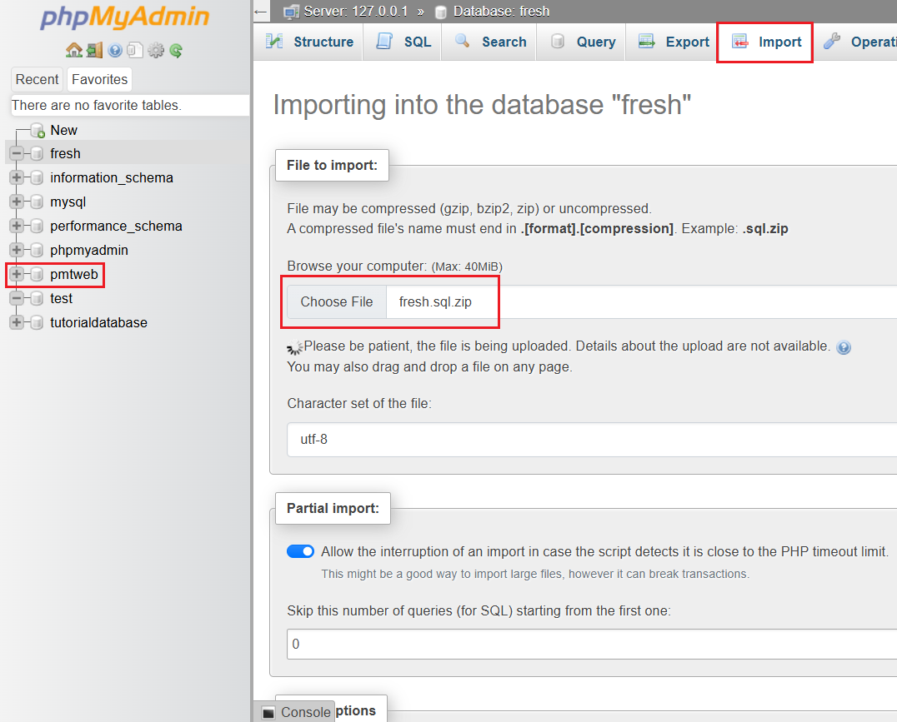

# Setting up local server
1. To set up Prime's `pmtweb` on your device's localhost, you'll have to make sure your PHP version in `xampp` is the same (for consistency) as `pmtweb`. Prime's `pmtweb` uses `PHP 7.4.33`.

1. To check your php version, start up `mysql` and `Apache` in `xampp`. Open up VS code and open the `htdocs` folder in `xampp`. Create a file inside `htdocs` called `info.php` and type:
    ```php
    <?php
    phpinfo();
    ```

    

1. Now go to your web browser and type in the following. Do note that the url might differ based on your `folder structure` and localhost `port number` (it's 80 by default).
    ```
    // Link differs based on port number & filepath!
    localhost/info.php
    ```
    
1. You should see a page shown below. You can view your php version at the top.

    

1. If the version is `PHP Version 7.4.33`, you can skip till `step 11`.

1. Otherwise, go to [this](https://windows.php.net/downloads/releases/archives/) `php` download site and download the `php-7.4.33-Win32-vc15-x64.zip` file.

1. Unzip the file and rename it to `php`. Please check that you have a file named something like `php7apache2_4.dll` in the folder. If you don't, go back to the site and download the `php-7.4.33-nts-Win32-vc15-x64.zip` (non-thread-safe version) instead.

1. Make sure to rename the old php folder in `xampp` to something else like `old_php`. After which, move the newly downloaded php folder into `xampp`. 

1. Opening up the folder, you should see 2 config files in the `php` folder: `php.ini-production` and `php.ini-development`. Since we're using `xampp`, we should be using `php.ini-development`. Rename it to `php.ini` (Yup, you're changing the file type).

1. Open up `xampp control panel` and on `Apache` row, click on `config > Apache (httpd:xampp.conf)`.

    

    1. Find the following:
    ```php
    LoadFile "/xampp/php/php8ts.dll"
    LoadModule php_module "/xampp/php/php8apache2_4.dll"
    ```
    1. Change `php8ts.dll` to `php7ts.dll`
    1. Change `php_module` to `php7_module`
    1. Change `php8apache2_4.dll` to `php7apache2_4.dll`

1. You'll need `mysqli` extension in `php` enabled to connect to `pmtweb`. To enable this, on `Apache` row, click on `config > PHP (php.ini)`. 

    

    1. Search for the line:
        >extension=mysqli
    1. Make sure that this line is `uncommented`. If you see a `;` at the front of this line, remove it to uncomment.

1. Now go back to `info.php`. If you see a `mysqli` section when you search for it, you're good to go.
    ```    
    // Link differs based on port number & filepath!
    localhost/info.php
    ```

    

1. If you don't, it's most likely the issue with the filepath to the `ext` folder in php. To fix this, in the `php.ini` file, find this section:
    ```
    ; Directory in which the loadable extensions (modules) reside.
    ; http://php.net/extension-dir
    ;extension_dir = "./"
    ; On windows:
    ;extension_dir = "ext"
    ```
    1. Type in the filepath to the `xampp>php>ext` folder and `uncomment` it. It should look like this:
    ```
    ; Directory in which the loadable extensions (modules) reside.
    ; http://php.net/extension-dir
    ;extension_dir = "./"
    ; On windows:
    extension_dir = "C:\xampp\php\ext"
    ```

1. Check `info.php` again to confirm the mysqli section is there.

1. Once this is done, make sure you have access to the `pmtweb` repository (if you don't, ask your supervisor). Git clone the project into the `htdocs` folder in `xampp`.

1. Now, you'll have to create the database for `pmtweb`. Go to `phpMyAdmin` and create a new database as shown below. Make sure the database uses `utf8_general_ci`!
    ```
    // Link differs based on port number & filepath!
    localhost/phpMyAdmin
    ```

    

1. Click on the newly created `pmtweb` database and go to the `import` tab above. Download [this](./documentation/others/pmtweb.sql.zip) zip file and import it. Use default settings for the other options and click `Import` at the bottom. After a while, the database should be ready to go.

    

1. Lastly, you'll need to add a user with ALL PRIVILEGES. To do this, select the `pmtweb` database > SQL tab and paste this inside:
    ```sql
    CREATE USER 'prime'@'localhost' IDENTIFIED BY 'Prime!23';
    GRANT ALL PRIVILEGES ON *.* TO 'prime'@'localhost' WITH GRANT OPTION;
    FLUSH PRIVILEGES;
    ```
    1. Click on `Go` to exceute the code.

    

1. Once the user is created, type the url shown below to access `pmtweb` on the web!
    ```
    // Link differs based on port number & filepath!
    localhost/pmtweb/index.php
    ```